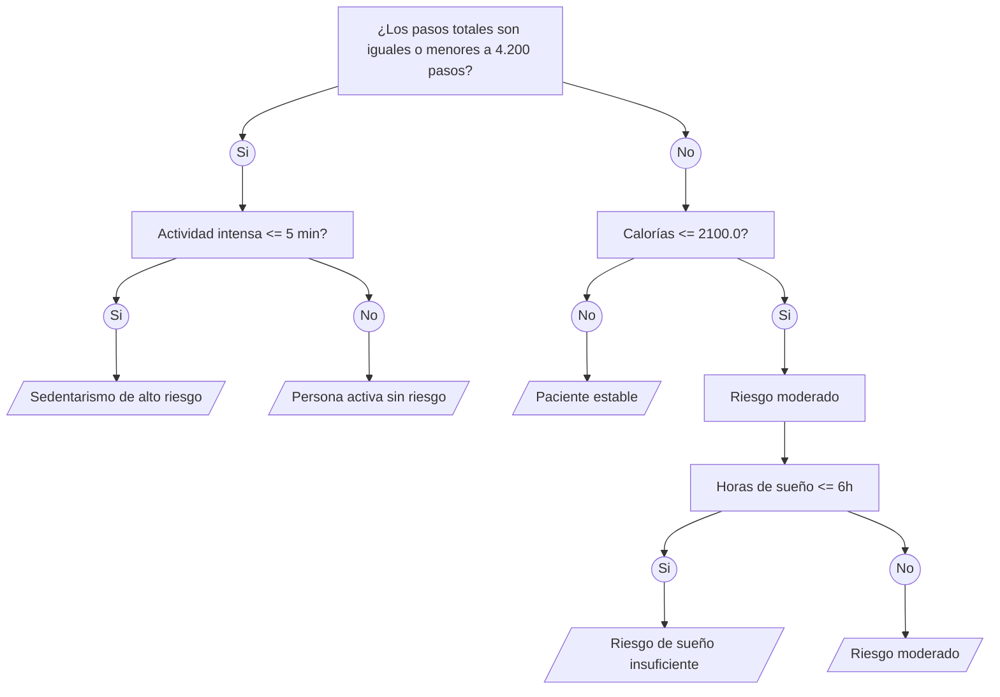

# Avance 2: Primer Artefacto

## Árbol de Decisiones

```mermaid
flowchart TD
    N1["¿Los pasos totales son iguales o menores a 4.200 pasos?"] --> S1((Si))
    N1 --> N1_NO((No))

    S1 --> N2["Actividad intensa <= 5 min?"]
    N2 --> S2((Si))
    N2 --> N2_NO((No))

    S2 --> D1[/Sedentarismo de alto riesgo/]
    N2_NO --> D2[/Persona activa sin riesgo/]

    N1_NO --> N3["Calorías <= 2100.0?"]
    N3 --> S3((Si))
    N3 --> N3_NO((No))

    N3_NO --> D3[/Paciente estable/]

    S3 --> R1["Riesgo moderado"]
    R1 --> N4["Horas de sueño <= 6h"]
    N4 --> S4((Si))
    N4 --> N4_NO((No))

    S4 --> D4[/Riesgo de sueño insuficiente/]
    N4_NO --> D5[/Riesgo moderado/]
```